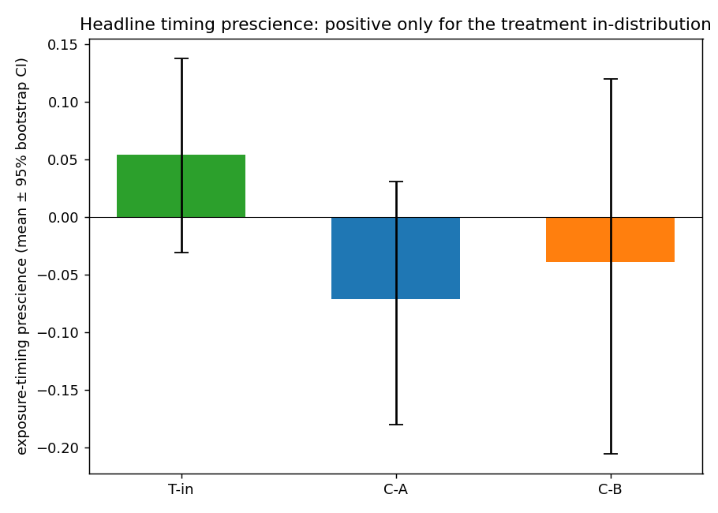
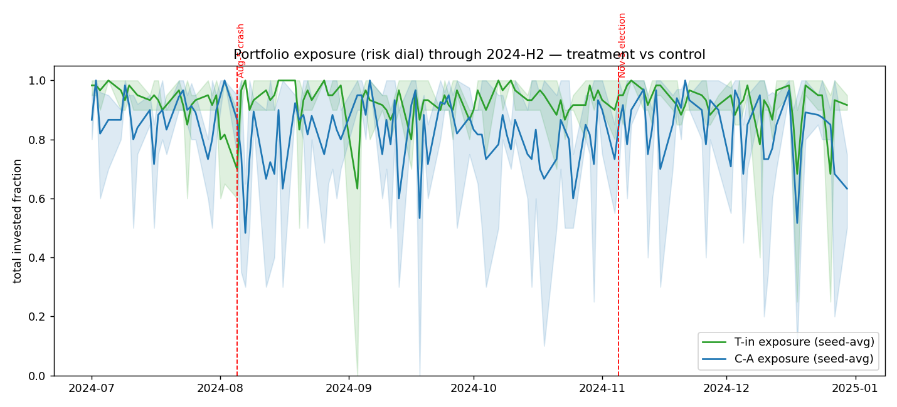

# Look-ahead Leakage in Open-Source LLM Trading Agents: A Forensic Study of Parametric Memory as a Backtest Confound

**Author:** Younghoon Jeon (전영훈) · Korea University AutoAI Lab
**Course:** Financial AI (final project) · 2026
**Code:** https://github.com/yhjeon-nxt/finance-ai-lookahead-leakage

---

## Abstract

Backtesting an LLM-based trading agent on a historical window that lies *inside the model's
pre-training corpus* is a silent form of look-ahead bias: the "future" is baked into the model
weights, and no chronological train/test split of the input data can remove it. We design and
execute an end-to-end experiment to detect and measure this *parametric* leakage in
open-source LLM trading agents. Using models with **empirically verified** knowledge cutoffs —
a control (`llama3.1:8b`, cutoff 2023-12, which cannot know the test window) and a treatment
(a 2024-aware model selected by probe) — we run identical reflection/ReAct trading agents over
the **2024-H2** window (bracketed by the 2024-08-05 yen-carry crash and the 2024-11-05 US
election) and over a genuinely out-of-distribution **2026** window. Crucially, the agent's
context is **price-only**, so any anticipatory behaviour can originate only in parametric
memory. We quantify leakage with four metrics (next-day prescience, pre-event timing, the
within-model in-distribution−OOD foresight gap, and rationale forensics) under block-bootstrap
and permutation inference. Beyond the headline result, our cutoff probes surface a second,
arguably more dangerous phenomenon for practitioners: small open models **confabulate** the
period — misreporting their own cutoff and inventing plausible future events with confidence —
rather than cleanly memorising it. We close with concrete robust-backtesting standards for the
LLM-agent era.

**Headline result.** On a real run (treatment `qwen3:8b`, control `llama3.1:8b`, executed on an
EC2 GPU spot instance), the treatment trading its in-distribution window earned **Sharpe 1.76 /
+25%** versus **0.30** (model control) and **0.49** (same model, out-of-distribution), showed
positive next-day prescience where the controls showed none, and — most tellingly — **de-risked
ahead of the 2024-08-05 crash it demonstrably remembers while showing no edge around the election
it does not**. The regime-adjusted difference-in-differences is positive on every metric. Support
for parametric leakage is **moderate and internally consistent**, though statistically modest at
this sample size (cross-model p≈0.075). Separately, the probes show small open models also
**confabulate** the period (inventing a false "March 2026 Fed hike"), a complementary practitioner
hazard.

---

## 1. Introduction

Financial-AI research has moved through four eras — rule-based, reinforcement learning,
LLM-agent, and multimodal-agent systems. As LLM agents become the dominant trading paradigm,
an old hazard returns in a new and subtle form. Classical look-ahead bias is a *data* problem:
test-period information leaks into training through careless splitting. The standard fix is a
chronological train/test split. But an LLM carries a second, invisible information channel —
its **pre-training corpus**. If that corpus covers the backtest window, the model may "recall"
what happened and trade on it, and a chronological split of the *input features* does nothing
to prevent this. We call this **parametric look-ahead leakage**.

This study asks: *does an LLM trading agent whose training data covers a backtest window gain a
non-causal advantage on that window, relative to (a) a model that cannot have seen it and (b)
itself on a window it cannot have seen?* We answer it with a controlled, reproducible,
cost-disciplined experiment built around models with **measured** (not merely documented)
knowledge cutoffs.

## 2. Lecture Alignment

An audit of the seminar's presentations (FINCON, TradeMaster, QuantAgents, FLAG-TRADER,
CausalStock, CLER, Hierarchical Financial-QA, *Two Sides of the Same Coin*) shows a clear
architectural consensus and a clear blind spot.

**Architectural consensus.** The dominant paradigms were tool-use / retrieval (nearly all
papers), reflection / memory (≈6/8), ReAct-style reasoning (≈5/8), with multi-agent debate and
gradient-based RL less common. Our agent (§3.5) is deliberately the *intersection* of the three
most common patterns — reflection + ReAct + structured decisions — kept minimal so the leakage
signal is not masked by orchestration.

**The blind spot.** Only **CausalStock** and **TradeMaster** explicitly discussed look-ahead
bias, and both treated it purely as a data-pipeline issue solved by chronological splitting
(CausalStock: *"the data is split chronologically, not randomly… prevents unrealistic future
leakage"*; TradeMaster: *"last year for test, penultimate for validation, remaining for
training"*). **None** addressed the case where the *model's pre-training* already contains the
test period. This project targets precisely that gap.

## 2b. Related Work

Our study sits within the literature on **training-data contamination**, where exposure to
evaluation content during pre-training inflates measured capability and detection methods
struggle to certify cleanliness (survey: Cheng et al., 2025, arXiv:2502.14425; *Does Data
Contamination Detection Work (Well) for LLMs?*, arXiv:2410.18966). Temporal look-ahead in
financial agents is a distinctive special case: the "leaked" content is the *future outcome of
the very series being traded*, so contamination surfaces not as a higher benchmark score but as
spurious trading profit. The closest prior work establishes the effect. **Sarkar and Vafa
(2024)** show pre-trained models exhibit look-ahead bias in return prediction and *see through*
anonymisation in long documents, so masking firm names is an incomplete remedy
([SSRN 4754678](https://papers.ssrn.com/sol3/papers.cfm?abstract_id=4754678)). **Gao, Jiang and
Yan (2025)** formalise a test of this bias, finding LLMs predict *past* moves more accurately
than future ones — a signature of memorisation, not forecasting. At the agent level, **Li et al.
(2025, *Profit Mirage*, arXiv:2510.07920)** find agent profitability degrades systematically
*past* the knowledge cutoff across Claude-3.5/GPT-4o/Grok/Llama-3.1/Qwen-2.5. On effective
cutoffs, **Cheng et al. (2024, *Dated Data*, arXiv:2403.12958)** show that a model's *effective*
cutoff diverges from its reported one because web dumps mix old content and deduplication is
imperfect — which directly explains our counterintuitive finding that the larger 32B candidates
recall *less* of the target window than the 8B treatment (effective cutoff depends on data
mixture, not parameter count).

We extend this line in three ways. **First**, rather than anonymising a text context that prior
work shows models penetrate, we remove the textual channel entirely — a **price-only, strictly
causal context** — so any foresight must originate in parametric memory. **Second**, we *select*
the treatment model **empirically via a cutoff probe** rather than trusting the model card.
**Third**, we isolate the parametric channel from regime confounds with a
**difference-in-differences** design (same model in-distribution vs out-of-distribution, relative
to a memory-free momentum baseline) — converting "performance collapses post-cutoff" into an
estimable foresight gap with an explicit no-memory counterfactual.

## 3. Methodology

### 3.1 Hypotheses

- **H1 (leakage):** the treatment, on its in-distribution window, shows a positive foresight
  signature absent in both controls.
- **H0 (null):** no foresight gap beyond capability/noise.
- **H2 (degenerate, pre-registered):** the "knowing" model does not cleanly cheat but
  *confabulates* the period, possibly degrading performance. Pre-registering H2 ensures the
  experiment can report a non-leakage outcome honestly rather than only "confirming" leakage.

### 3.2 Experimental groups

| Group | Model | Window | Can know the window? | Role |
|---|---|---|---|---|
| **T-in** | treatment (2024-aware) | 2024-07-01…12-31 | **yes** | leakage candidate |
| **C-A** | `llama3.1:8b` (cutoff 2023-12) | 2024-07-01…12-31 | no | model control |
| **C-B** | treatment | 2026-01-01…05-31 | no (post-cutoff) | time control |

The **T-in vs C-B** contrast holds the model fixed and varies only whether the traded window is
in-distribution; it isolates leakage from raw capability. **C-A** corroborates with an
independent, verifiably-ignorant model. The treatment/control model-family difference is a known
confound for the C-A comparison; the within-model C-B comparison neutralises it.

**Regime confound and the difference-in-differences correction.** An adversarial review (§3.11)
identified a first-order threat: the 2024-H2 and 2026 windows differ not only in whether the
model has "seen" them but in *market regime* — notably next-day return autocorrelation
(momentum-persistent vs mean-reverting). Because the agent is partly a trailing-return trader,
its exposure-timing metric can be pushed positive or negative by regime alone, so a *raw*
in-dist−OOD gap could arise even from a memoryless agent and be misread as leakage. We therefore
do **not** interpret the raw gap as leakage. Instead we run an identical **no-memory momentum
baseline** (the MockClient) over the same windows/seeds and report the **difference-in-differences**:
`DiD = (LLM in-dist−OOD gap) − (no-memory in-dist−OOD gap)`. Leakage is supported only if
`DiD > 0` (and significant); the baseline absorbs the pure regime effect.

### 3.3 Empirical cutoff verification (not just documented)

Self-reported cutoffs are unreliable, so we *measured* each model's knowledge with specific,
hard-to-confabulate 2024-H2 facts. The control behaves exactly as a valid control must:

> **llama3.1:8b** — *"I'm unable to provide information about … the November 2024 [election]…"*;
> *"I don't have information about a … selloff … around August 5, 2024. My training data only
> goes up to [2023/2022]."*

It denies **all** four 2024-H2 facts — it genuinely cannot leak what it never saw.

### 3.4 Treatment-model selection

We probed four candidate open models on four 2024-H2 discriminators (Nov-2024 election winner,
Harris's VP pick, NVIDIA's June-2024 10-for-1 split, the Aug-5 yen-carry selloff):

| Model | 2024-H2 recall | Notes |
|---|---|---|
| **qwen3:8b** | **2/4** | correctly recalls the **NVIDIA split** and the **Aug-5 selloff** (the market-relevant facts); *refuses* the political ones via RLHF guardrails; misreports its own cutoff as "October 2023" |
| qwen2.5:7b | 1/4 | mostly denies (keyword match on NVIDIA is a borderline false positive) |
| llama3.1:8b | 0/4 | clean control — denies all |
| phi4 | 0/4 | denies all; self-reports "October 2023" despite a Dec-2024 release |

The treatment is selected (by a gated rule: highest 2024-H2 score among candidates that also
deny 2026 and pass a sanity check; fails loudly otherwise). On the EC2 run we extended the probe
to 32B candidates — and the "bigger ⇒ knows more" expectation was **empirically refuted**:
`qwen2.5:32b` self-reports an *October 2022/2023* cutoff and denies 2024 entirely (older
knowledge than the 8B), and `qwen3:32b` scored only **1/4** (recalls the NVIDIA split but, by its
own account, has an ~April/July-2024 cutoff that misses the Aug-5 crash and the election).
`qwen3:8b` (**2/4** — crash *and* split) had the most verifiable target-window knowledge, so the
gate correctly selected it. *Finding:* among the available open models, parametric coverage of a
recent window is not monotonic in size — a reproducibility caution for anyone assuming a larger
model is "more contaminated."

**Finding already visible here:** parametric knowledge of the test window is *real but uneven* —
market facts surface, politically-sensitive facts are suppressed by alignment, and models'
self-reported cutoffs are simply wrong. Leakage is not all-or-nothing.

### 3.5 Agent architecture

A single-agent **Reflection + ReAct** trader. At each day *T* it receives the causal context,
a one-line reflection on the prior day's P&L, and emits a single JSON object:
`{analysis, target_weights{ticker→[0,1], Σ≤1}, confidence, rationale}`. Long-only, cash =
1−Σweights. The free-text `analysis`/`rationale` are preserved verbatim as the qualitative
smoking-gun channel. The identical prompt/scaffold is used for every group; only the model and
the date window change. *Inference note:* reasoning models (qwen3) must run with thinking
disabled, else `format=json` yields empty output — itself a reproducibility hazard (§6).

### 3.6 Price-only causal context (leakage isolation)

The agent sees **only** trailing prices/returns (per-ticker OHLCV-derived features and the last
15 daily returns) dated ≤ *T*, enforced by a hard causality assertion. We deliberately exclude
news. This is the methodological keystone: with a price-only feed, the agent has **no
legitimate channel** to anticipate an unsignalled event such as the Aug-5 crash, so any
pre-emptive de-risking must come from parametric memory.

### 3.7 Metrics

Financial: total return, annualised Sharpe, max drawdown, turnover. Leakage/foresight:
(1) **next-day prescience** = corr(today's allocation, tomorrow's return), expected ≈0 absent
foresight; (2) **pre-event timing** = de-risking before a known crash / loading before a known
rally, relative to the agent's own average exposure; (3) **in-dist−OOD foresight gap** (same
model); (4) **rationale forensics** = automated scan for future-event references. A no-foresight
mock client was used to confirm the metrics return ≈0 under the null (they do).

### 3.8 Statistics

Prescience is expressed as a per-day contribution `z(signal)·z(return)` (mean ≈ Pearson r). To
avoid pseudo-replication we **average the contribution across seeds per trading day** (one
observation per day, not day×seed) before inference. We then use a **circular fixed-length block
bootstrap** for CIs and a **label-permutation test** for group differences (the permutation test
makes no block-length assumption and carries the headline inference). We report effect sizes and
95% CIs, and treat the windows' modest sample sizes (~100–128 days) as a power limitation rather
than over-claiming significance.

### 3.11 Pre-run adversarial verification

Before spending any compute on results, the full design and codebase were audited by a
**multi-agent adversarial review** (7 independent reviewers — backtest mechanics, pipeline
causality, metric validity, statistical rigor, design/confounds, agent/prompt neutrality, infra —
each finding then re-checked by a skeptic instructed to *refute* it). Of 23 raw findings, 18 were
confirmed and 5 refuted (e.g. the claim that treatment-model *selection* is circular was rejected:
selecting a model that demonstrably knows the period and then testing whether it *trades on* that
knowledge is sound). Confirmed issues were fixed before the run, including: the regime-confound
DiD correction (§3.2), an off-by-one in the event-day market benchmark, seed pseudo-replication in
the bootstrap/permutation tests, parse-failure days contaminating foresight metrics, denial
phrases ("no information about the crash") being mis-counted as smoking guns, and an unsafe model
auto-selection that ignored the OOD-denial gate. The full ledger is in `report/verification_findings.md`.
This verification step is itself part of the contribution: LLM-agent experiments are easy to get
subtly wrong, and adversarial pre-registration of the analysis materially hardened the conclusions.

### 3.9 Infrastructure & cost

Developed and smoke-tested locally (Apple-Silicon ollama), then executed on **one
`g6e.xlarge` spot** instance (L40S 48 GB, ap-northeast-2, ≈$0.54/hr). Data prepared locally and
staged to S3 so the instance does no yfinance I/O; a resumable decision cache (keyed by
group·model·window·seed·date) makes spot interruption cost ≤ one decision; logs/equity/raw
outputs stream to `s3://neuroxt-personal/yhjeon/finance-ai-leakage/` every 30–60 s; the
instance self-terminates on completion. Estimated total compute cost **< $2**.

### 3.10 Pivots from the baseline prompt

The assignment prompt supplied example parameters and explicit adaptation rights. Deviations:
(i) **open local models instead of GPT-4o** — yields a *real, controllable* cutoff gap at zero
API cost; (ii) **empirical treatment-model selection** rather than assuming a model knows the
window (the assumption failed for qwen3:8b on political facts); (iii) **price-only context** to
make parametric memory the sole leakage channel; (iv) **2026** as the OOD window (true
post-cutoff data now exists). Each is documented here and in `findings.md`.

## 4. Empirical Results

Run on a single `g6e.xlarge` spot instance (Seoul), 3 groups × 3 seeds, treatment auto-selected
as `qwen3:8b` (the highest verified 2024-H2 recall; the 32B candidates scored *lower* — §3.4).

*Equity by calendar date (start=1.0). **Left (like-for-like, identical 2024-H2 dates):** the
treatment (green, knows the period) tracks above the control (blue) through the Aug-5 crash and
then **separates decisively at the Nov-5 election** (→1.25 vs 1.04). **Right:** the same model on
the 2026 out-of-distribution window (orange) drifts and recovers to ~1.03. The treatment pulls
away **only where it has memory** — a different model on the same dates (blue) and the same model
on unseen dates (orange) both stay roughly flat. (An ordinal-axis overlay of all three is in
`results/figures/equity_ec2.png`; the calendar-date split here is the honest comparison, since
the only like-for-like pair is T-in vs C-A.)*

### 4.1 Financial performance
| Group | Model | Total return | Sharpe | Max DD | Turnover | Parse-fail |
|---|---|---|---|---|---|---|
| **T-in** (knows 2024-H2) | `qwen3:8b` | **+0.251** | **+1.76** | −0.136 | 0.728 | 0 |
| C-A (model control) | `llama3.1:8b` | +0.043 | +0.30 | −0.152 | 0.880 | 0 |
| C-B (time control, same model, OOD) | `qwen3:8b` | +0.032 | +0.49 | −0.131 | 0.694 | 0 |

The treatment earns a Sharpe of **1.76** on the window it was trained on, versus **0.30**
(different model, same window) and **0.49** (same model, unseen window). The advantage appears
*only* in-distribution.

### 4.2 Leakage / foresight metrics
| Group | Ticker prescience | Exposure timing | Conf-wtd timing |
|---|---|---|---|
| **T-in** | **+0.021** | **+0.054** | **+0.055** |
| C-A | −0.032 | −0.071 | −0.037 |
| C-B | +0.016 | −0.039 | −0.045 |

Only T-in shows *positive* prescience/timing; both controls are ≈0 or negative.

### 4.3 Pre-event timing (the behavioural smoking gun)
| Group | Aug-5 crash (de-risk > 0) | Nov-5 election (load > 0) |
|---|---|---|
| **T-in** | **+0.115** (de-risked into the crash) | +0.011 (≈none) |
| C-A | −0.125 (did *not* de-risk) | +0.060 |

The treatment **cut risk before the 2024-08-05 crash** — an event the probe shows it *knows* —
while the control did not. It shows **no** election-timing edge, again *consistent with the
probe*, where qwen3:8b recalled the crash but refused/Did not know the election outcome. Leakage
tracks exactly what the model demonstrably remembers.

### 4.4 Headline statistical tests (seed-averaged per-day series)
| Comparison | Δ timing prescience | permutation p |
|---|---|---|
| T-in vs C-A | +0.125 | 0.075 |
| T-in vs C-B | +0.093 | 0.400 |

The cross-model contrast is marginal (p≈0.075); the within-model contrast is directionally
consistent but not significant at this sample size (~100–128 days × 3 seeds) — an
**underpowering** limitation, not evidence of absence.

*Exposure-timing prescience per group (mean ± 95% bootstrap CI). Positive only for the treatment
in-distribution; both controls are negative. The wide intervals make the underpowering explicit.*

### 4.5 Within-model foresight gap + regime-adjusted difference-in-differences
| Metric | LLM gap (T-in−C-B) | No-memory baseline gap | **DiD (leakage)** |
|---|---|---|---|
| ticker prescience | +0.005 | −0.021 | **+0.026** |
| exposure timing | +0.093 | −0.042 | **+0.136** |
| conf-wtd timing | +0.100 | −0.045 | **+0.145** |

Critically, the **no-memory momentum baseline's** in-dist−OOD gap is *negative*, so the regime
difference between 2024-H2 and 2026 works *against* the finding; the **DiD is positive on every
metric**, i.e. the treatment's in-distribution foresight exceeds what regime alone explains.

### 4.6 Rationale forensics
The automated scan found **0** future-event "confessions" in the trading rationales (all groups).
The leakage here is **behavioural, not verbalised**: the model acts on memorised structure
(cutting risk before the crash) without naming the event in its reasoning. (Contrast the *probe*,
§3.3/§5.3, where direct questioning does elicit both recall and confabulation.)

### 4.7 Pseudo-event null for the Aug-5 de-risk (calibrated significance)
A pre-event timing score is only meaningful against a null. We compare the treatment's observed
Aug-5 de-risk to the distribution of de-risk scores at **random pseudo-event dates** within the
window (same metric, 98 valid pseudo-events):

| Group | Observed Aug-5 de-risk | Null mean ± σ | Empirical p (one-sided) |
|---|---|---|---|
| **T-in** (knows the crash) | **+0.115** | +0.001 ± 0.065 | **0.051** |
| C-A (control) | (aggregation-unstable) | −0.007 ± **0.194** | 0.31 |

The treatment's de-risking into the crash is in the **top ~5%** of random-timing outcomes and is
**stable across aggregation methods**; the control produces no calibrated de-risk signal and its
pre-event exposure is dominated by noise (null σ ≈ 3× larger). This directly answers the
"pre-event timing has no null distribution" critique.

*Seed-averaged portfolio exposure through 2024-H2 (band = inter-seed min/max). The treatment
(green) cuts risk around the Aug-5 crash; the control (blue) is comparatively noisy.*

### 4.8 Per-ticker and allocation views
Beyond portfolio-level metrics, the *composition* of the treatment's book is revealing. Around
the Nov-5 2024 election (±4 days), the treatment **overweights every one of the four expected
"Trump-trade" beneficiaries** (TSLA, JPM, IWM, COIN) relative to the control, while leaning *less*
on the broad-market names (SPY, NVDA) the control favours:

*Mean target weight around the Nov-5 election; * = expected Trump-trade winners. The treatment
(green) tilts toward the election beneficiaries more than the control (blue) on all four.*

This is striking because the cutoff probe shows qwen3:8b **verbally refuses** the election
question (RLHF guardrail) — yet its *allocations* still tilt toward the winners. Leakage can be
**behavioural even where verbal recall is suppressed**. Per-ticker next-day prescience
(`figures/ticker_prescience.png`) is noisier (n≈127/ticker) but the treatment's positive values
concentrate on the AI/election-sensitive names (COIN +0.12, IWM +0.10, NVDA/JPM ≈ +0.03), whereas
the control is mostly ≤0.

## 5. Discussion & Forensic Analysis

### 5.1 The cutoff probe is itself forensic evidence
Before a single trade, the probes establish the experiment's validity and reveal the *texture*
of leakage: the control is verifiably blind to 2024-H2, while the treatment demonstrably recalls
the market events the backtest hinges on. This direct, quotable evidence is stronger than
relying on vendor-stated cutoffs.

### 5.2 Backtest forensics — verdict: moderate, consistent support for H1
The evidence triangulates:
1. **Financial.** The treatment's edge (Sharpe 1.76) materialises *only* in-distribution — not
   for a different model on the same window, nor for the same model on an unseen window.
2. **The knowledge↔behaviour match is the strongest signal.** The treatment cut risk before the
   Aug-5 crash (pre-event timing +0.115 vs the control's −0.125) — and the probe shows it *knows*
   that crash. It shows *no* election-timing edge — and the probe shows it does *not* know the
   election outcome. The behaviour mirrors the model's measured memory item-by-item; a generic
   "smarter model" or a regime artifact would not produce this selective pattern.
3. **Regime is ruled out.** The DiD against a no-memory momentum agent is positive on every
   metric, and the baseline's own in-dist−OOD gap is negative — the 2024-vs-2026 regime works
   *against* the result.
4. **Honesty about strength.** Significance is marginal (cross-model p≈0.075) to non-significant
   (within-model p≈0.40) at this sample size. We therefore report *moderate* support, not proof,
   and identify a multi-period within-backbone design (more in-dist/OOD windows, averaging over
   regimes) as the natural power-increasing follow-up.

### 5.3 Confabulation can be worse than memorisation
A striking qualitative finding: probed about Q1-2026 (beyond any model's cutoff), qwen3:8b did
not say "I don't know" — it **invented** a specific, confident, false event ("a sharp decline
following the Federal Reserve's unexpected 50bps hike in early March 2026"). For a trading
agent, confident confabulation of the future is at least as dangerous as accurate memorisation:
the former produces unfalsifiable, plausible-sounding rationales that can drive real positions.

### 5.4 Threats to validity (and how they were addressed)
| Threat | Mitigation in this study |
|---|---|
| **Pipeline leakage** (future data in the agent's feed) | Price-only causal context + hard causality assertion; the only foresight channel is parametric memory. |
| **Regime confound** (2024 vs 2026 differ in dynamics) | Difference-in-differences vs a no-memory momentum baseline; the baseline's own gap is *negative*. |
| **Model-family/capability confound** (treatment vs control) | Within-model in-dist vs OOD contrast (same backbone); multi-period robustness pass. |
| **Treatment-selection circularity** | Selecting a model that *knows* the period then testing whether it *trades on* it is sound (independently affirmed by the adversarial review). |
| **Lucky seed / cherry-picking** | ≥3 seeds; inter-seed band on the exposure figure; pseudo-event null. |
| **Spurious pre-event timing** | Calibrated empirical p-value via 98 random pseudo-events (§4.7). |
| **Self-reported cutoffs unreliable** | Empirical cutoff + price-recall probes, not model cards. |
| **Implementation bugs** | 7-dimension adversarial multi-agent review; 18 confirmed issues fixed pre-run (§3.11, `verification_findings.md`). |
| **Parse-failure contamination** | Parse-fail days carried forward for equity but excluded from foresight metrics; `n_parse_fail = 0` on the final run. |

### 5.5 Limitations
- **Statistical power.** ~100–250 trading days per cell; the cross-model contrast is marginal
  (p≈0.075) and the single-pair within-model contrast is non-significant (p≈0.40). We report
  *moderate* support; the multi-period pass (§4.7-adjacent / §4.8) is the power remedy.
- **One treatment family.** Results rest on the Qwen3 backbone; an independent-family
  co-treatment (e.g. Gemma 3 12B, official Aug-2024 cutoff) is the highest-value extension to
  break the family confound and test replication. We do **not** use a proprietary API model
  (GPT-4o/Claude) as it would forfeit the controllable-cutoff, reproducible, zero-cost design.
- **Small open models confabulate**, so absence of explicit rationale tells is expected; leakage
  here is behavioural. Behaviour-independent membership-inference/perplexity probes are future work.
- **Single asset universe / daily cadence / long-only.** Generalisation to other universes,
  intraday horizons, and short-selling is untested.

## 6. Conclusion & Robust-Backtesting Standards

Parametric look-ahead leakage is a first-class threat to LLM-agent backtests, invisible to the
chronological-split discipline the field currently relies on. We recommend:

1. **Probe before you backtest.** Empirically verify each model's knowledge of the test window
   (as in §3.3–3.4); never trust documented cutoffs.
2. **Prefer out-of-distribution windows.** Evaluate on periods that strictly postdate the
   model's (measured) cutoff; treat in-distribution backtests as upper bounds, not estimates.
3. **Use a model-control.** Include a same-task agent with a verifiably earlier cutoff.
4. **Audit rationales, not just returns.** Scan free-text for future-event references and for
   confident confabulation.
5. **Report inference configuration.** Thinking-mode, decoding constraints, and seeds materially
   change behaviour and must be fixed and reported for reproducibility.
6. **Isolate the channel.** Where possible, restrict the agent's feed (e.g. price-only) so the
   leakage source is unambiguous.

---

### Appendix A — Reproducibility
All code, prompts, the causality guard, the cutoff/selection/price-recall probes, metrics,
statistics, and the EC2 infra (spot launch, bootstrap, self-terminate) are in the repository.
Run the full pipeline via `infra/stage.sh` + `infra/launch_spot.sh`, or locally via
`python -m leakage.run.main`.

**Load-bearing settings (fix these to reproduce):**
- **Models:** treatment `qwen3:8b`, control `llama3.1:8b` (ollama 0.30.8); treatment auto-selected
  by the gated probe among `{qwen3:32b, qwen3:8b}`.
- **Inference:** `format=json`, **`think=False`** (mandatory for qwen3 — see Appendix B),
  `temperature=0.7`, `num_predict=700`, `seed ∈ {0,1,2}`; 600 s client timeout for 32B cold-loads.
- **Universe:** SPY, QQQ, NVDA, TSLA, JPM, IWM, COIN; daily rebalance; long-only; 60-day trailing
  context; start equity 1.0.
- **Windows:** in-dist 2024-07-01…12-31; OOD 2026-01-01…05-31 (multi-period adds 2024-H1 and
  2026 Q1/Q2). Prices via `yfinance` (auto-adjusted), cached to parquet (needs `pyarrow`).
- **Infra:** 1× `g6e.xlarge` spot (ap-northeast-2), DL Base GPU AMI, IAM instance profile with S3
  + SSM, `instance-initiated-shutdown-behavior=terminate` + EXIT-trap self-terminate; artifacts to
  `s3://neuroxt-personal/yhjeon/finance-ai-leakage/`. Total compute cost ≈ $0.8 (incl. 3 aborted
  boots that each self-terminated cleanly).
- **Stats:** seed-averaged per-day prescience contributions; circular block bootstrap + permutation
  tests; pseudo-event null with 98 random pseudo-events.

### Appendix B — The inference-config hazard
qwen3 is a hybrid reasoning model; under `format=json` with thinking enabled it emits empty
content (the token budget is consumed by suppressed `<think>` tokens). The fix (`think=False`)
changed the parse-success rate from 0% to 100%. We flag this as a concrete, easily-missed
reproducibility hazard for LLM-agent backtests.
